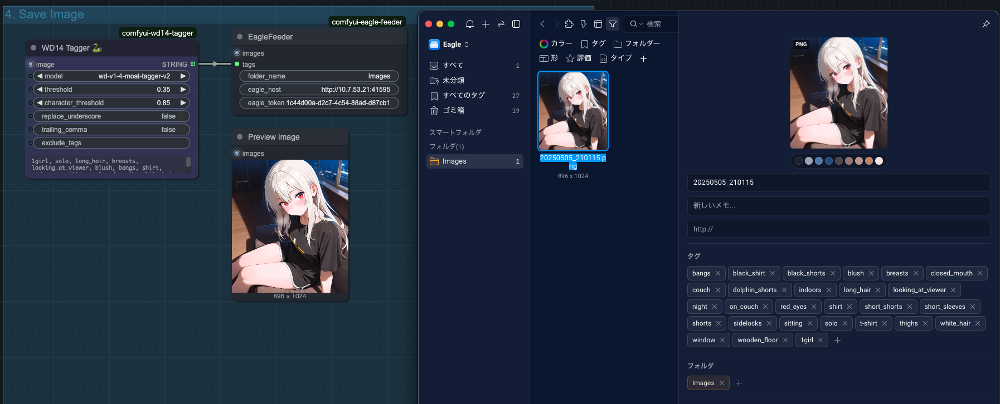
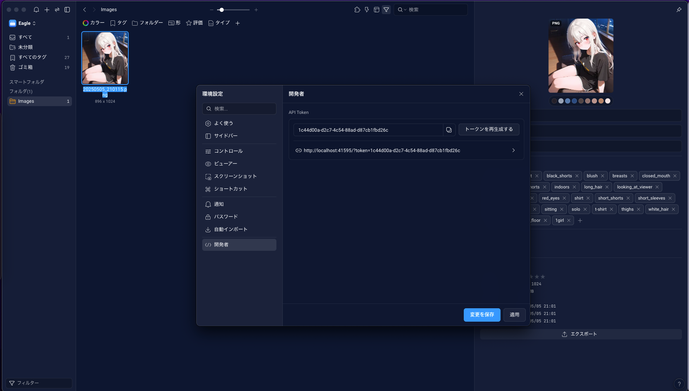

# ComfyUI Eagle Feeder

[[日本語]](./README_JP.md)

A custom node for [ComfyUI](https://github.com/comfyanonymous/ComfyUI) that allows you to send images directly to [Eagle](https://jp.eagle.cool/).

## Features

Existing similar nodes work only when Eagle and ComfyUI run on the same machine. This node solves that limitation by supporting setups using SSH or containers across different machines.

It temporarily launches a local file server and sends images to Eagle using the `/api/item/addFromURL` API.

## Installation

### ComfyUI Manager

Search for `ComfyUI Eagle Feeder`.

### Manual

Clone the repository into your `custom_nodes` directory:

```bash
git clone https://github.com/tighug/comfyui-eagle-feeder.git
```

## Usage



- `tags`: Tags to attach to the image.

  - Can use prompt tags or tags from [WD14-Tagger](https://github.com/pythongosssss/ComfyUI-WD14-Tagger?tab=readme-ov-file).

- `folder_name`: The name of the Eagle folder where the image will be saved.

  - Currently does not support creating new folders automatically.
  - If multiple folders share the same name, the image will be saved to one of them arbitrarily.

- `eagle_host`: URL of the host where Eagle is running.

  - If Eagle is running on the same machine as ComfyUI, use `http://localhost:41595`.
  - Note: Eagle uses a fixed port: `41595`.

- `eagle_token`: API token for Eagle.

  - You can find this under `Preferences → Developer` in Eagle.

Token location in Eagle:


## License

[MIT](./LICENSE)
