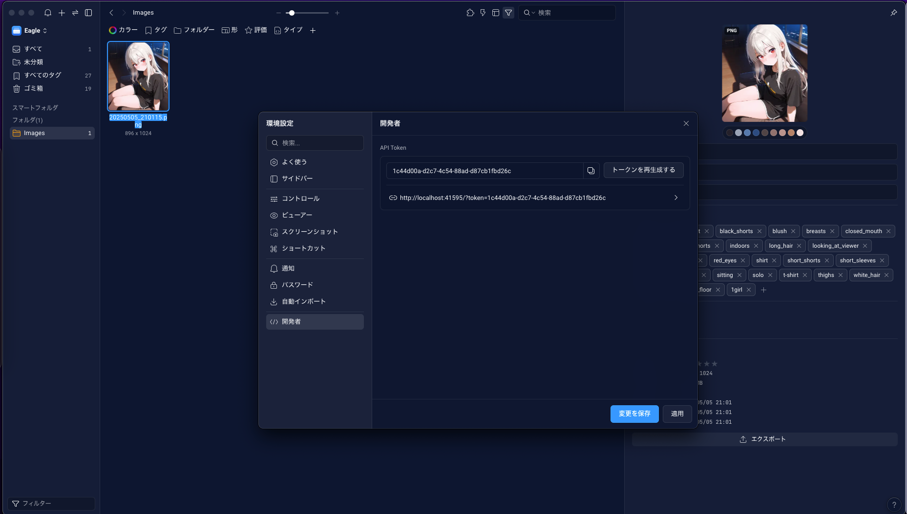

# ComfyUI Eagle Feeder

[[English]](./README.md)

ComfyUI 上で[Eagle](./https://jp.eagle.cool/)に画像を送信するためのカスタムノードです。

## Features

既存の類似ノードでは Eagle と ComfyUI を同じマシンで実行する場合には機能しますが、SSH やコンテナを使って異なるマシン上で実行する場合に機能しなかったため作成しました。

一時的にファイルサーバーを起動し、Eagle API の`/api/item/addFromURL`を介して画像を送信します。

## Installation

### ComfyUI Manager

`ComfyUI Eagle Feeder`で検索してください。

### Manual

`custom_nodes`ディレクトリ内にクローンしてください。

```bash
git clone　https://github.com/tighug/comfyui-eagle-feeder.git
```

## Usage


- `tags` : 画像のタグ
  - プロンプトや[WD14-Tagger](./https://github.com/pythongosssss/ComfyUI-WD14-Tagger?tab=readme-ov-file)のタグを使用できます。
- `folder_name` : 画像を保存する Eagle のフォルダ名
  - フォルダが存在しないときに新規作成する機能は未実装です。
  - 同名のフォルダが複数存在する場合、どれか一つに保存されます。
- `eagle_host` : Eagle が起動しているホスト URL
  - ComfyUI と同じマシン上で起動している場合は`http://localhost:41595`を指定してください。
  - Eagle の仕様上、ポート番号(41595)は固定です。
- `eagle_token` : Eagle の API トークン
  - Eagle の`環境設定 → 開発者`から確認可能です。

トークンの記載箇所


## License

[MIT](./LICENSE)
